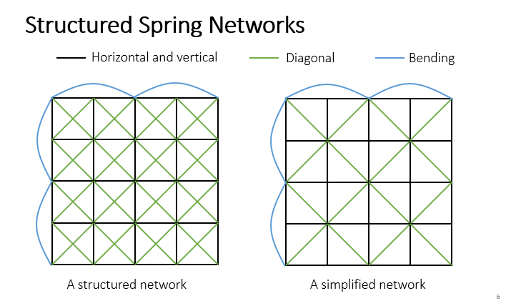
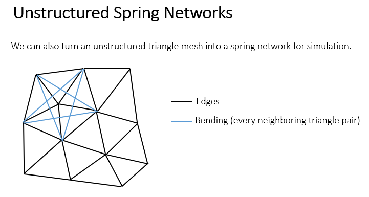
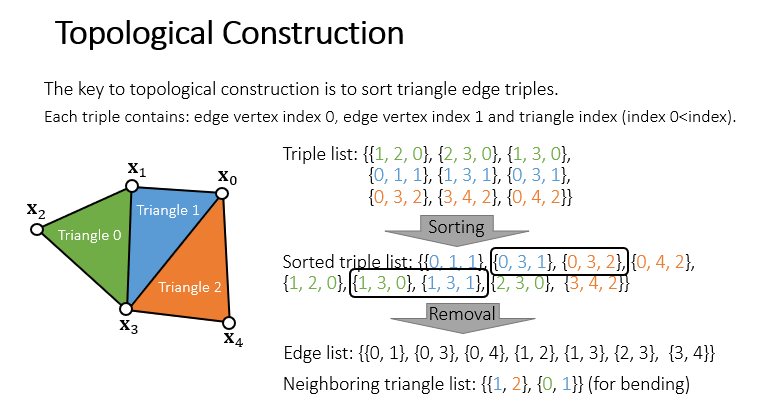
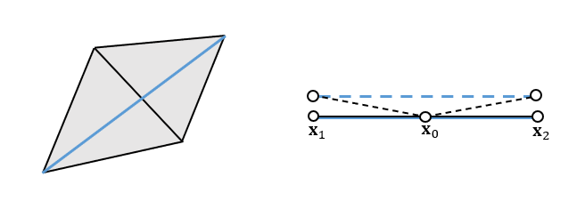
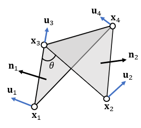
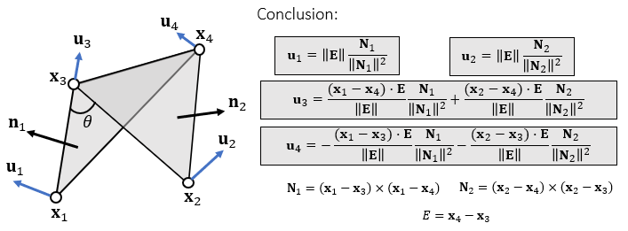
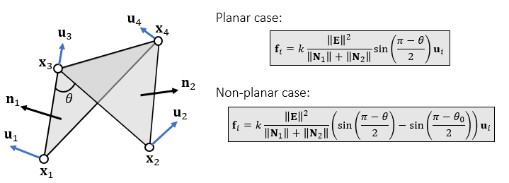
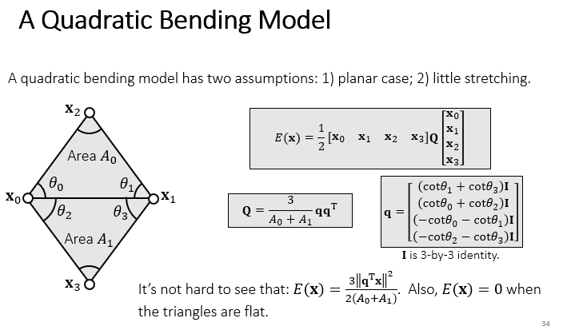
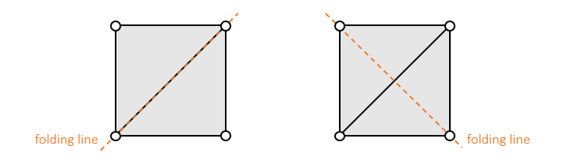

# 弹簧约束的物理模型
对于一个原长为$L$的理想的弹簧，有以下的数学关系
$$
\begin{matrix}
对于弹簧两端点\vec x_i,\vec x_j\\
能量:E(\vec x)=\frac{1}{2}(||\vec x_i-\vec x_j||-L)^2\\
对于势能来说,作用力是能量对时间的导数(梯度),因此作用力为:\\
f_i(x_i)=-\nabla_i E(x)=-k(||\vec x_i-\vec x_j||-L)\frac{\vec x_i-\vec x_j}{||\vec x_i-\vec x_j||}\\
f_j(x_j)=-\nabla_j E(x)=-k(||\vec x_i-\vec x_j||-L)\frac{\vec x_j-\vec x_i}{||\vec x_i-\vec x_j||}
\end{matrix}
$$

# 布料的几何建模

## 网格状几何
对于网格状的几何，可以使用弹簧连接每一个四边形的对角线，同时在边缘添加相隔一定长度的弹簧来防止布料无阻碍地弯曲

## 三角面片几何
对于三角面片来说，对于每一条内部边（两个三角形的共用边）所对应的两个对角顶点添加一个弹簧

添加弹簧时，注意去掉重边，去掉重边的其中一个算法如下：
$$
\begin{matrix}
对于每一条边，使用三元组表示：(顶点1编号,顶点2编号,所属的三角形编号),其中顶点1和顶点2的编号需要以字典序排列\\
对于所有的三元组进行排列\\
排好的序列中，若相邻的两个三元组顶点1和顶点2的序号相同,则发现一条内部边
\end{matrix}
$$

# 积分方法
显式积分会导致能量的不守恒，因此采用隐式积分方法计算

## 隐式积分公式
$$
\begin{matrix}
\begin{cases}
v_1=v_0+\Delta tM^{-1}f_1\\
x_1=x_0+\Delta tv_1
\end{cases}\\
整理得:\\
\begin{cases}
x_1=x_0+\Delta t v_0+\Delta t^2M^{-1}f_1\\
v_1=(x1-x0)/\Delta t\\
\end{cases}\\
其中,M为一个对角阵,对角元为每个质点的质量,其余元素均为n维向量,这个公式是一个线性方程组
\end{matrix}
$$

## 隐式积分求解
由于隐式积分中，$f_1$的信息是根据$x_1$和$v_1$的信息而得来的，因此上面的公式计算实际上是求解一个方程组（假设$f_1$只与$x_1$有关），如下：
$$
x_1=x_0+\Delta t v_0+\Delta t^2M^{-1}f(x_1)
$$
做如下推导将问题转化为最优化问题：
$$
\begin{matrix}
令F(x)=\frac{1}{2\Delta t^2}||x-x_0-\Delta tv_0||^2_M+E(x)\\
其中,||x||^2_M=x^TMx\\
对F求梯度:\\
\nabla F(x_1)=\frac{1}{\Delta t^2}M(x_1-x_0-\Delta tv_0)-f(x_1)\\
当F(x_1)取最小值时,其梯度为0,此时令\nabla F(x_1)=0,整理得:\\
x_1-x_0-\Delta tv_0-\Delta t^2f(x_1)=0\\
形式上与要求解的方程组相同\\
\end{matrix}
$$
有了以上的推导，对于求解方程组的问题有以下的进一步表述：
$$
即求x,使得函数F(x)取极值
$$
可以使用牛顿迭代法进行求解：
$$
\begin{matrix}
假设函数任意阶可导,对函数导数泰勒展开:F'(x)=F'(x_k)+F''(x_k)(x-x_k)+......\\
令F'(x)=0则:\\
F'(x_k)=-F''(x_k)(x-x_k)=F''(x_k)\Delta x\\
\Delta x = -F''^{-1}(x_k)F'(x_k)\\
x_{k+1}\leftarrow x+\Delta x
\end{matrix}
$$
将上式推广到矩阵形式：
$$
\begin{matrix}
\Delta x\leftarrow-(\frac{\partial^2F(x_k) }{\partial x^2})^{-1}\nabla F(x_k)\\
x_{k+1}\leftarrow x_k+\Delta x\\
其中:\\
\nabla F(x_1)=\frac{1}{\Delta t^2}M(x_1-x_0-\Delta tv_0)-f(x_1)\\
\frac{\partial^2F(x_k) }{\partial x^2}=\frac{1}{\Delta t^2}M+H(x_k)\\
代入:
\Delta x=-(\frac{\partial^2F(x_k) }{\partial x^2})^{-1}\nabla F(x_k)\\
\frac{\partial^2F(x_k) }{\partial x^2}\Delta x=-\nabla F(x_k)\\
(\frac{1}{\Delta t^2}M+H(x_k))\Delta x=-\nabla F(x_k)=-\frac{1}{\Delta t^2}M(x_1-x_0-\Delta tv_0)+f(x_1)\\
实际上是求解如上所述的方程组
\end{matrix}
$$
其中的关键问题之一在于求解矩阵$H$,或者叫做Hessian矩阵（在弹簧系统的情形下，Hessian矩阵就是弹性系数的高维推广），求解过程如下：
$$
\begin{matrix}
f(x_{ij})=-k(||x_{ij}||-L)\frac{x_{ij}}{||x_{ij}||}\\
H(x_{ij})=-\frac{\partial f(x_{ij})}{\partial x_{ij}}=k\frac{x_{ij}x_{ij}^T}{||x_{ij}||^2}+k(||x_{ij}||-L)(\frac{I||x_{ij}||-\frac{x^T}{||x_{ij}||}x_{ij}}{||x_{ij}||^2})\\
=k\frac{x_{ij}x_{ij}^T}{||x_{ij}||^2}+k(1-\frac{L}{||x_{ij}||})(I-\frac{x_{ij}x_{ij}^T}{||x_{ij}||^2})\\
记H(x_{ij})=H_e\\
对于有N个顶点的系统:\\
f(x)=\left[\begin{matrix}
f_1(x)\\
...\\
f_n(x)
\end{matrix}\right]\\
从而H(x)=\nabla f(x)=\Sigma_{e={ij}}
\left[\begin{matrix}
&&&\\
&\frac{\partial f_{ij}(x)}{\partial x_{ij}}&\frac{\partial f_{ij}(x)}{\partial x_{ji}}&\\
&\frac{\partial f_{ji}(x)}{\partial x_{ij}}&\frac{\partial f_{ji}(x)}{\partial x_{ji}}&\\
&&&
\end{matrix}\right]\\
f_{ij}(x)=-f_{ji}(x),故:\\
从而H(x)=\nabla f(x)=\Sigma_{e={ij}}
\left[\begin{matrix}
&&&\\
&H_e&-H_e&\\
&-H_e&H_e&\\
&&&
\end{matrix}\right]\\
\end{matrix}
$$

对于Hessian矩阵的正定性讨论如下：
$$
\begin{matrix}
对于非零向量v\\
v^TH_ev=kv^T\frac{x_{ij}x_{ij}^T}{||x_{ij}||^2}v+k(1-\frac{L}{||x_{ij}||})v^T(I-\frac{x_{ij}x_{ij}^T}{||x_{ij}||^2})v\\
v^T\frac{x_{ij}x_{ij}^T}{||x_{ij}||^2}v=||\frac{x_{ij}^Tv}{x_{ij}}||^2>0\\
v^T(I-\frac{x_{ij}x_{ij}^T}{||x_{ij}||^2})v=\frac{x_{ij}^2v^2-||x_{ij}v||^2}{||x_{ij}||^2}\geq0\\
故而当||x_{ij}||<L时,H_e可能非正定,否则是正定的
\end{matrix}
$$
对于一个系统来说，若$H_e$正定，则系统有唯一解(类比于当一个函数的二阶导<0，该函数有唯一解)
因此可以得到一个结论：**当拉伸时，弹簧系统有唯一解，而当压缩时，弹簧系统不一定有唯一解**

如何求解一个线性方程组：
+ 直接法：LU分解等
+ 迭代法：Jacobbi法等

## 隐式积分算法
算法总结如下：
对每一次迭代过程，做如下操作：
+ 根据上面的公式计算方程组系数，即一个二阶导和一个一阶导
+ 根据方程组的解$\Delta x$更新位置$x_1$
+ 根据位置更新速度$v_1$

# 弯曲抵抗模型
对于弯曲的情况，质点弹簧模型在弯曲较小的时候抵抗并不明显，这是因为对于微小的弯曲，两个质点之间往往距离改变不大（如图）。

因此有一些其他的模型可以解决这一问题。

## 二面角模型
使用两个平面的二面角的函数来进行弯曲抵抗的计算可以解决这种情况，模型如下：
$$
f_i=f(\theta)u_i
$$

对于任意时刻的弯曲，有以下的四种力：
+ $u_1$、$u_2$作用于边所对应的顶点上，方向与对应的三角形法线相同，用于控制布料的弯曲
+ $u_3$、$u_4$作用于边上，保证在弯曲的过程中边不被延长

力的大小由以下的性质决定：
+  $u_1$、$u_2$与法线同向
+  $u_3$、$u_4$是沿边方向合力为0，因此合力是两法线的线性组合，同时也是 $u_1$、$u_2$的线性组合
+ 由于是系统内力，因此合力为0，即$u_1+u_2+u_3+u_4=0$
推导可得如下表达式：

且有：

若布料的平衡状态不为平面，则$\theta_0\neq0$

## 二次弯曲模型
一种基于拉普拉斯变换的模型，计算两个面的曲率，以这个曲率来定义势能

这一模型中有能量的定义，且$q$为一个常数矩阵，因此进行隐式积分运算的时候非常简单
$$
\begin{matrix}
f(x)=-\nabla E(x)=-Q\left[\begin{matrix}x_0\\x_1\\x_2\\x_3\end{matrix}\right]\\
H=Q
\end{matrix}
$$

# Locking Issue
对于三角形的弯折，当弯折方向与弹簧方向垂直是，由于弹簧的抵抗，将很难弯曲

其本质的原因在于模拟自由度的缺失，其中有3N个顶点，边数为3N-3-边界的边数，每一条边对应着一个约束
因此总的自由度为：边界的边数+3