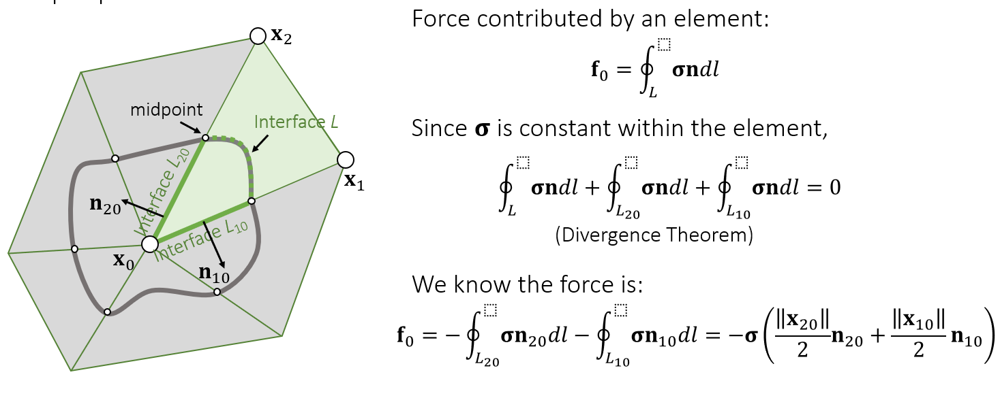
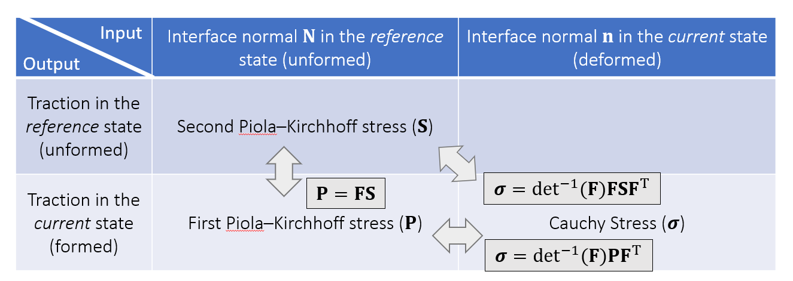
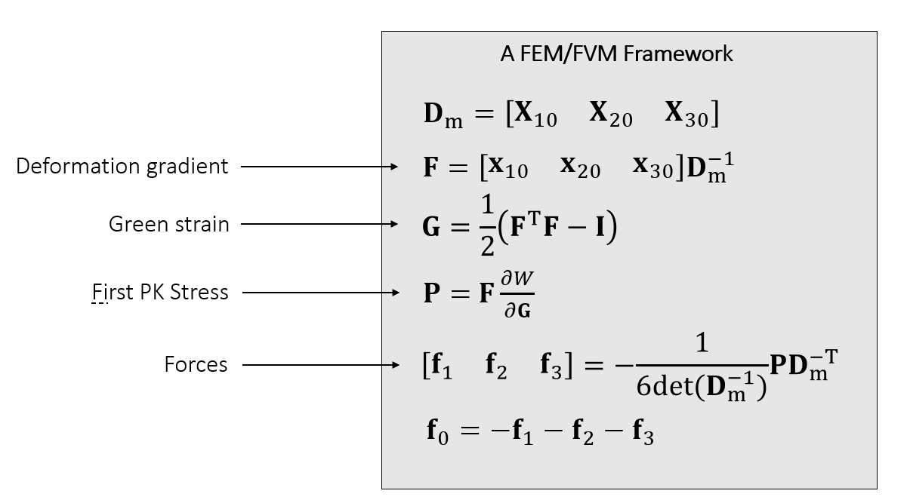
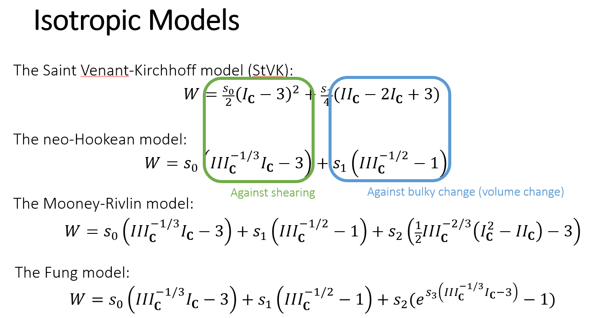
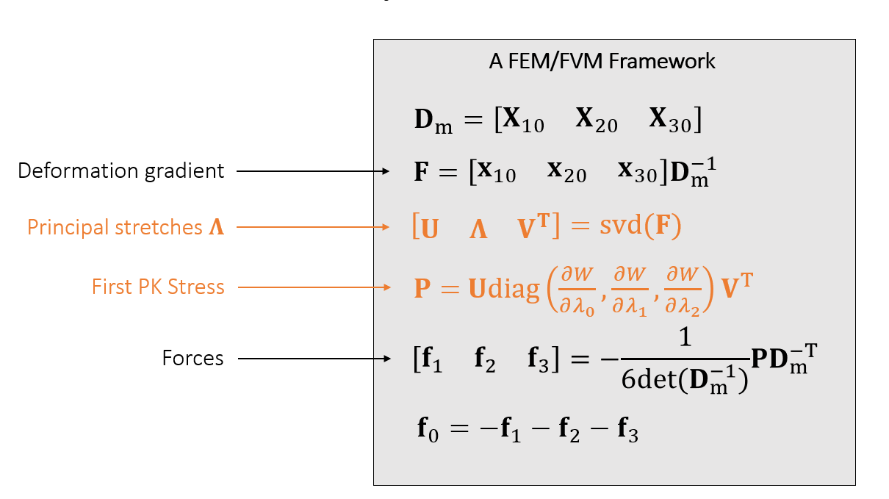

# FEM(finite element method)
对于一个三角形，其上任意一点在此三角形发生变化之后坐标关系如下：
$$
x=FX+c
$$
其中$X$为这一点原坐标，$x$为变换后坐标，$c$为常数向量
对于三角形的两条边而言：
$$
\begin{matrix}
F(X_a-X_b)=x_a-x_b\\
F(X_a-X_c)=x_c-x_c\\
从而:
F=[\begin{matrix}x_{ab}&x_{ac}\end{matrix}][\begin{matrix}X_{ab}&X_{ac}\end{matrix}]^{-1}
\end{matrix}
$$
即可将$F$计算出来
这样的$F$定义不仅包含了形变，还包含了旋转，为了描述纯正的形变，我们需要在$F$变换中去掉多余的旋转

## Green Strain
由奇异值分解的思想可知，对于任意一个线性变换：
$$
F=UDV^T
$$
其中$V$为旋转矩阵，用于将发生缩放的轴旋转至与坐标轴对齐；$D$为缩放矩阵，用于在坐标轴将点进行缩放；$V$为旋转矩阵，用于将物体旋转至所需角度
而矩阵$V^T$与$D$集中表现了物体的形变，因此要描述物体的形变，就要消去$U$矩阵的影响，定义Green Strain:
$$
G=\frac{1}{2}(F^TF-I)=\frac{1}{2}(VD^2V^T-I)
$$
Strain的意思是一个用于描述形变的数学量，$||G||$越大，形变程度越大
Green Strain与旋转无关，来自于以下的观察：
$$
G=\frac{1}{2}(F^TR^TRF-I)
$$
在二维的情况下，有：
$$
G=\left[\begin{matrix}
\epsilon_{uu}&\epsilon_{uv}\\
\epsilon_{uv}&\epsilon_{vv}
\end{matrix}\right]=G(\epsilon_{uu},\epsilon_{uv},\epsilon_{vv})
$$

## 能量定义
定义能量密度(在未发生形变的reference状态下)：
$$
W(G)=W(\epsilon_{uu},\epsilon_{uv},\epsilon_{vv})
$$
从而一个面积的能量为：
$$
E=\iint_{A_{Ref}}W(\epsilon_{uu},\epsilon_{uv},\epsilon_{vv})d\sigma
$$
 记：
 $$
 S=\frac{\partial W}{\partial G}
 $$
 $S$称为stress tensor，物理含义为能量密度对于形变的导数，类似于能量对于位移的导数，与力有关
 力的计算如下：
 $$
 f_i=-(\frac{\partial E}{\partial x_i})^T=-A(\frac{\partial W}{\partial x_i})=-A_{Ref}(\frac{\partial W}{\partial\epsilon_{uu}}\frac{\partial\epsilon_{uu}}{\partial x_i}+\frac{\partial W}{\partial\epsilon_{uv}}\frac{\partial\epsilon_{uv}}{\partial x_i}+\frac{\partial W}{\partial\epsilon_{vv}}\frac{\partial\epsilon_{vv}}{\partial x_i})
 $$
 从定义出发，可以求得$\epsilon$以及和$\epsilon$相关的偏导，但是比较麻烦
 而对于以上的求解式整理得：
 $$
 [\begin{matrix}f_1&f_2\end{matrix}]=-A_{Ref}FS[\begin{matrix}X_1&X_2\end{matrix}]^{-1}
 $$
 根据这一公式可以简单计算每个顶点的力

# FVM(finite volume method)
对于两个弹性体，被一个曲面（或者曲线）分开来，记这个面上的力为$f$，则：
$$
f=\iint_Atds
$$
其中$t$可以理解为力的密度（单位面积上的力，或者说压强）
对于曲面上一点而言，其法线方向与受力方向不一定相同，定义一个矩阵$\sigma$为stress tensor
$$
t=\sigma n
$$
从而
$$
f=\iint_A\sigma nds
$$
**对于一个封闭区域，其受到的外力即为其区域边界上力的积分**
而对于同一个元内（三角形内），其$\sigma$不变，因此积分变为封闭区域边界上的法向量积分，为0

如图，在三角形的情况下，只要保证曲线必过三角形中点，则一个三角形对于整个区域的贡献即为其两个半边对于$t$的积分的相反数
$$
f_i=-\sigma(\frac{||x_{20}||}{2}n_{20}+\frac{||x_{10}||}{2}n_{10})
$$
对于三维的情况，做面积分即可，算的是四面体面积
$$
f_i=-\sigma(\frac{A_{012}}{3}n_{012}+\frac{A_{023}}{3}n_{023}+\frac{A_{031}}{3}n_{031})=\frac{\sigma}{6}(x_{01}\times x_{21}+x_{21}\times x_{31}+x_{31}\times x_{01})
$$

## 计算Stress tensor
Stress tensor本质上是将法线映射成为力
对于物体本身和法线是否发生了形变，可以分成四种Stress：

因此只需计算$S$，通过变换就可以得到$\sigma$

## 计算力
$$
\begin{matrix}
f_i=\frac{\sigma}{6}(x_{01}\times x_{21}+x_{21}\times x_{31}+x_{31}\times x_{01})\\
=-\frac{P}{6}(X_{01}\times X_{21}+X_{21}\times X_{31}+X_{31}\times X_{01})\\
=-\frac{FS}{6}b_1\\
S=\frac{\partial W}{\partial G}
\end{matrix}
$$
其中$b_1$是静止状态下，四面体三条边两两叉乘得到的和，可以通过提前计算得到
$S$也只和静止状态顶点有关，可以预计算
对于$b_1$，有如下的性质：
$$
\begin{matrix}
[\begin{matrix}X_{10}&X_{20}&X_{30}\end{matrix}]^Tb_1=[\begin{matrix}X_{10}&X_{20}&X_{30}\end{matrix}]^T(X_{01}\times X_{21}+X_{21}\times X_{31}+X_{31}\times X_{01})=\left[\begin{matrix}6Vol\\0\\0\end{matrix}\right]\\
[\begin{matrix}X_{10}&X_{20}&X_{30}\end{matrix}]^Tb_2=\left[\begin{matrix}0\\6Vol\\0\end{matrix}\right]\\
[\begin{matrix}X_{10}&X_{20}&X_{30}\end{matrix}]^Tb_3=\left[\begin{matrix}0\\0\\6Vol\end{matrix}\right]\\
从而有:
[\begin{matrix}b_1&b_2&b_3\end{matrix}]=\frac{[\begin{matrix}X_{10}&X_{20}&X_{30}\end{matrix}]^{-1}}{det([\begin{matrix}X_{10}&X_{20}&X_{30}\end{matrix}]^{-1}}
\end{matrix}\\
$$

## 算法
根据上面的分析,算法如下：

# Hyperelastic Models

## Isotropic Materials(各向同性材料)
对于各向同性材料，其Stress可表示为$F$的函数，即：
$$
P(F)=P(UDV^T)=UP(\lambda_0,\lambda_1,\lambda_2)V^T
$$
其中$\lambda$为每个方向的主拉伸量
$$
\begin{matrix}
一些补充的定义:\\
I_C=trace(C)=\lambda_0^2+\lambda_1^2+\lambda_2^2\\
III_C=\lambda_0^4+\lambda_1^4+\lambda_2^4\\
II_C=\lambda_0^2\lambda_1^2+\lambda_0^2\lambda_2^2+\lambda_1^2\lambda_2^2
\end{matrix}
$$
常见的各向同性模型：

对于各向同性模型的PVM算法如下：

