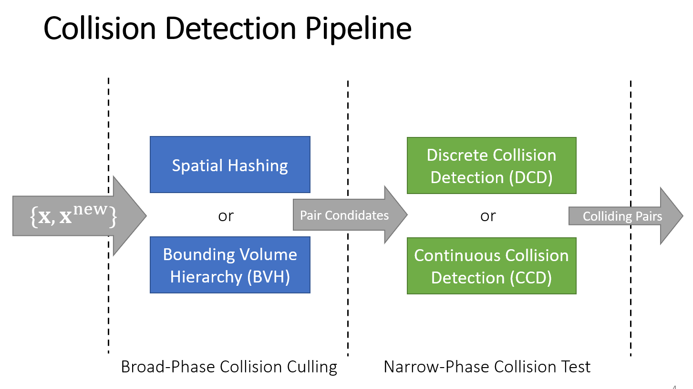
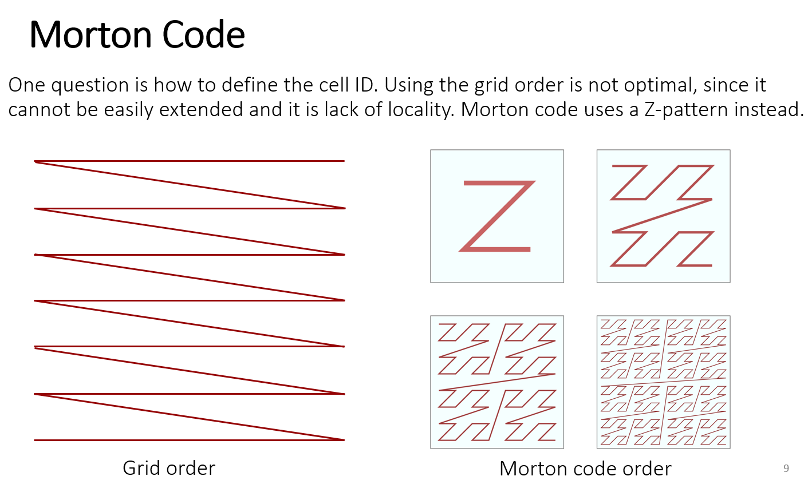
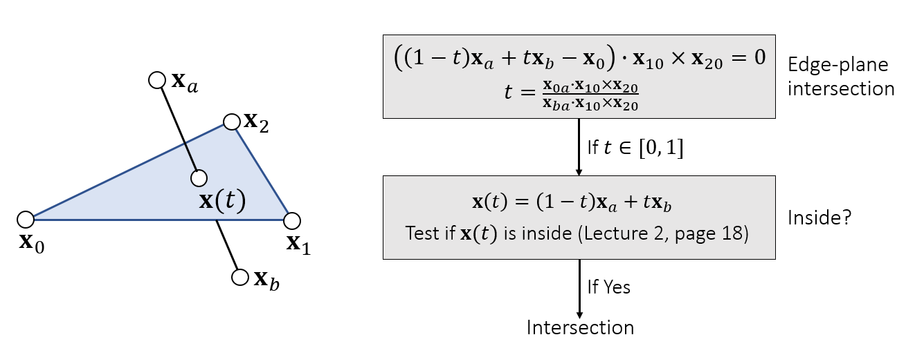
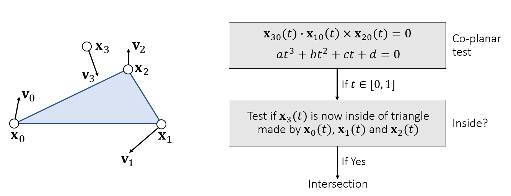
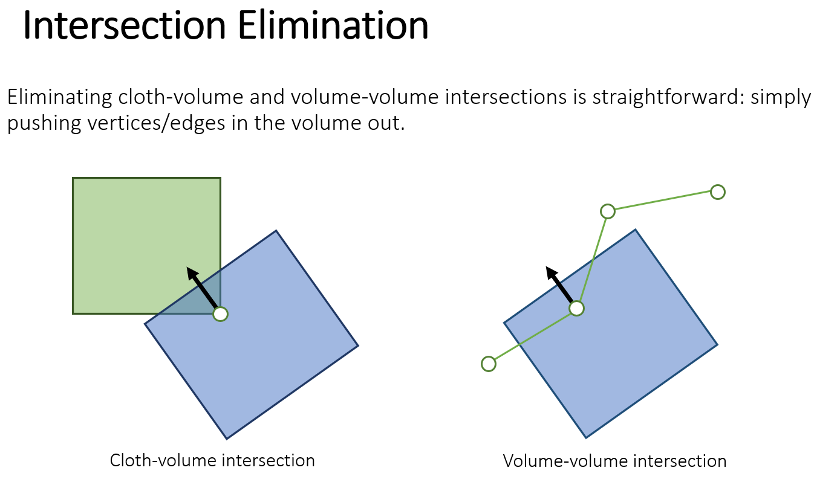
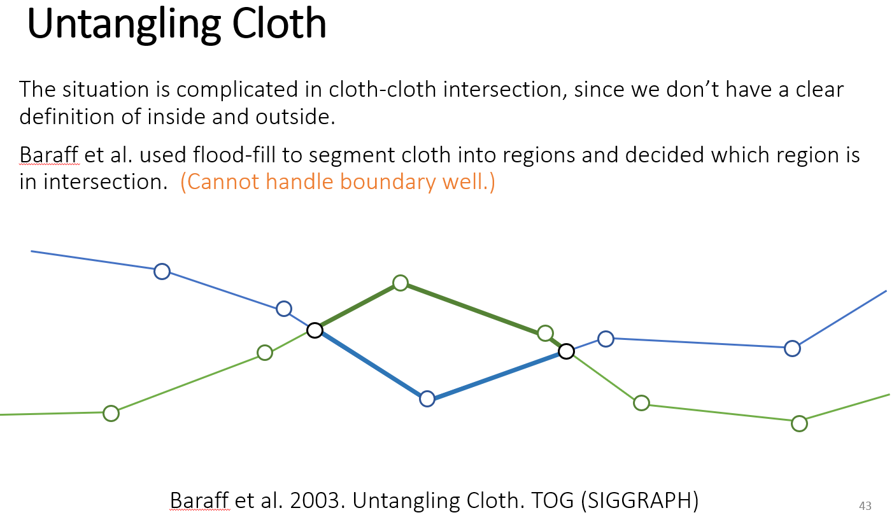
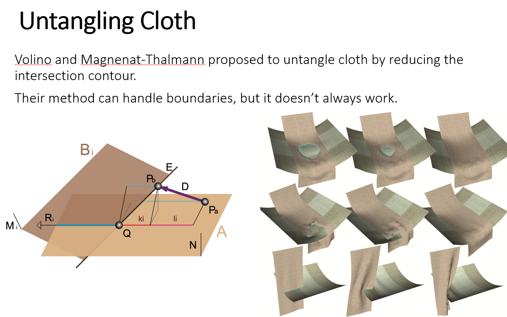

# 碰撞检测

碰撞检测分为两个阶段：
+ 碰撞剔除：输入上一帧位置与这帧位置，输出可能发生碰撞的点对
+ 碰撞检测：输入可能碰撞的点对，输出发生碰撞的点对
## Broad-Phase Collision Culling
### Spatial Partitioning(空间划分)
将空间划分为一个个的Cell，若两个三角形（或者；运动的三角形的轨迹整体出现在同一个格子里，则可能发生碰撞。
实际使用中，对每个三角形的三个顶点，保存点对(格子编号，三角形ID)。以格子编号进行排序，扫描数组比较三角形ID即可获取所有的可能发生碰撞的三角形
这种方法对GPU友好，因此很容易用CUDA实现
### Morton Code
在一个三维空间中，使用morton code的方式来保存空间相关的数据，可以提高访问内存速度

### BVH
对物体而非空间进行划分，以包围盒为单位组织，每个相邻的节点组成更大的包围盒，从而形成层次结构

局限性：对于临近的物体，BVH需要将树遍历到比较底层才能检测出相交

## Narrow-Phase Collision Test
### Discrete Collision Detection
实际上检测的是相交，最基本的方式是检测边与一个三角形的相交，可以利用数学方法来解决：

相交与碰撞是有区别的，由于时间是离散的，两个三角形可能发生了Tunneling(隧穿)。因此在两个时间步长中都没有发生相交，但在时间步长之间发生了碰撞，这就需要连续碰撞检测。

### Continuous Collision Detection
检测一个点是否在两个时间步长间穿过三角形的方法如下图所示：

对点和三个顶点的混合积，即四面体体积。当混合积为0时，碰撞发生。因此只需解令混合积为0的一元三次方程(一般用牛顿法或者夹逼解决)即可。
如果方程有多个解，一般取第一个即可。
#### 使物体返回安全位置的方法
一般使用Interior Methods和Impact Zone Optimization
Interior Methods从未发生碰撞的区域开始，一小步一小步地进行，直到到达区域边界
内点法本质上是一个优化方法，既要与发生碰撞的点更为接近，又不能发生碰撞
Impact Zone Optimization从发生碰撞的点开始可以使用较大的步长回到安全位置
Impact Zone也可以转化为一个优化问题
如果两种方法都无法解决问题，无论如何都会发生碰撞，则可以将整个区域返回到之前的未发生碰撞的状态，即封冻起来(Rigid Impact Zones)。封冻起来会导致区域中失去相对滑动

一般游戏开发使用小时间步长+DCD更好，而非CCD

# 碰撞解决
对于物体与物体、物体与布料的相交，直接使用某种方式将插入的点从物体中推出去即可

而对与布料和布料的碰撞则不能这么做，因为对于布料而言，并没有内外之分。
可以根据两块布料的相交点来划分布料，可以认为面积小的一部分为插入部分，因此将面积小的部分推出去直至没有碰撞。

除了上述方法之外，还可以考虑逐步缩短两个布料相交的交线，从而达到布料碰撞的解决。

