# 摘要
使用球面高斯函数对所有的光照项进行拆解，把渲染过程变为高斯函数的积分，从而实现实时并且保留较多高频信息的渲染，并且支持动态平行光和点光源。
# 数学依据
## 对BRDF的拆解和合并
大部分的BRDF可以根据其输入参数不同拆解为以下形式：
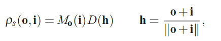
即入射方向有关项和观察方向有关项
对于Cook-Torrance模型来说，观察方向有关项即法线分布函数。可以用如下球面高斯进行近似：
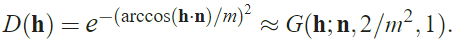
对于不同情况的BRDF来说，需要使用的SG的lobe数是不一样的。
当有了对于法线分布函数的拆解之后，要恢复原始的BRDF，只需将高斯近似的法线分布函数与剩余的两项进行相乘即可：
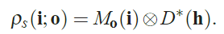
为了方便后续积分计算，要将这个以半角向量表达的SG进行**扭曲**（事实上是换元法）得到一个新的SG，这个新的SG以入射方向$\mathbf{i}$作为参数
入射方向与半角向量的关系为：
$$
\mathbf{i}=\Psi(\mathbf{h})=2(\mathbf{o}\cdot\mathbf{h})-\mathbf{o}
$$
改变SG的参数，有：
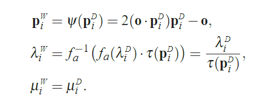
其中：
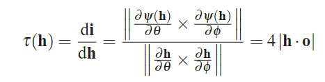
这样一来，原本的相乘就变为：
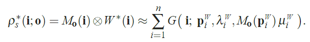
**假设了BRDF的其他两项在扭曲操作中不变**(即：$M_o(\mathbf{i})=M_o(\mathbf{p}_i^W)$，则BRDF可以直接用高斯函数的和来近似
## 对可见项的近似
对可见项的近似使用一个特殊的函数，即球面符号距离函数SSDF来实现。不同于传统的01可见函数，这个函数的符号表示是否可见，而函数值表示当前方向与最近阴影边界的夹角的最小值（类似于SDF中，函数值表示到边界的最小值，只不过这里是球面函数，所以是夹角），函数定义如下：
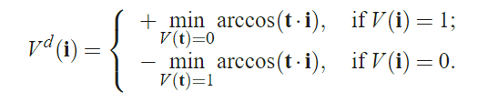
这个函数在每个顶点进行计算，并通过插值得到着色点的对应可见项，每个顶点预计算的SSDF用一个纹理保存起来，并且用PCA算法压缩
有了预计算的可见项，就可以从保存的数据中恢复并且与lobe进行球面积分
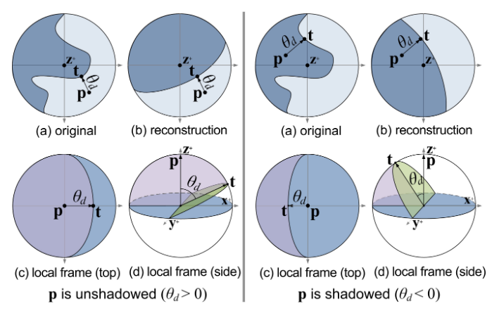
由于lobe的方向与法线不一定同向，为了方便积分，需要将二值可见项函数建立在以lobe的轴为中心的半球面上，从SSDF可以得到这样一个二值可见项函数：
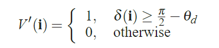
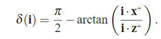
这样一来，任意一个SG与这一可见项函数的内积为：
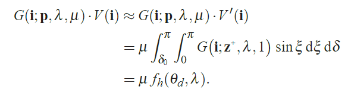
对于函数$f_h(\theta_d,\lambda)$可以进行预计算，这一预计算是如下进行的：
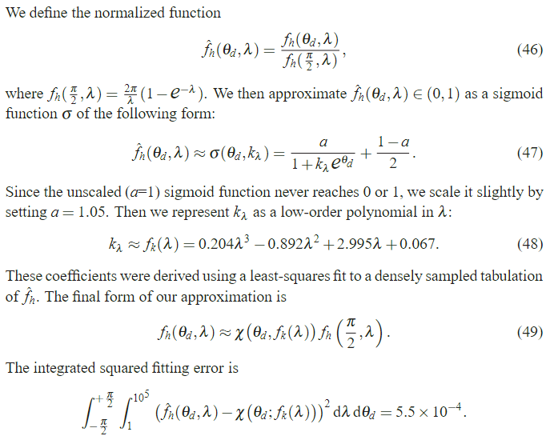
这一可见项方法在lobe较窄时会导致误差，而lobe较宽时误差可以接受
## 对点光源的近似
对点光源，直接使用一个SG来近似，可以支持动态点光源
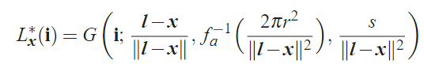
其中$\mathbf{l}$为点光源位置，$s$为光强，$r$为半径
对于无穷远处的光源，可以使用下列SG：
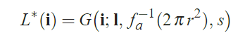
其中$\mathbf{l}$为点光源的方向
## 对环境光的近似
SG没有正交性，因此对于环境光的近似需要用若干高斯函数来对整个环境光进行拟合。论文提供了两种进行近似的方式：
1. 直接使用最小二乘法，求解若干高斯函数，适用于低频信息
2. 对环境光进行如下预计算，保存得出的结果，要进行环境光与任意高斯函数的点积时直接查表
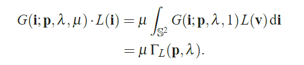
# 渲染
对于每个着色点，渲染需要的信息有：
+ 可见项使用PCA压缩后的系数
+ 从三角形不同顶点插值得来的BRDF的SG
+ 光源SG
将渲染方程分为视线相关和视线无关两项：
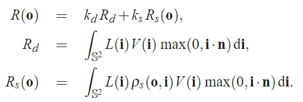
对于余弦项，也采用一个SG进行近似：
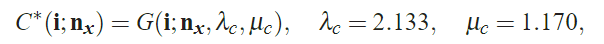
要计算Diffuse项，实际上就是三个高斯函数的“混合积”，即：
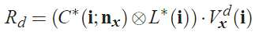
计算Specular项类似，只是需要多算一项BRDF
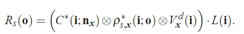
如果预计算好了环境光，直接查表就可以完成这个积分过程
而对于平行光和点光源，计算的可见项不太一样，如下：
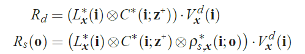
# 结果
+ 支持各向同性和各向异性材质
+ 支持高频细节
+ 支持光照旋转
+ 支持平行光源和点光源

# 局限
1. 对于可见项的计算局限于静态场景
2. 只考虑了阴影，多重反射没有考虑