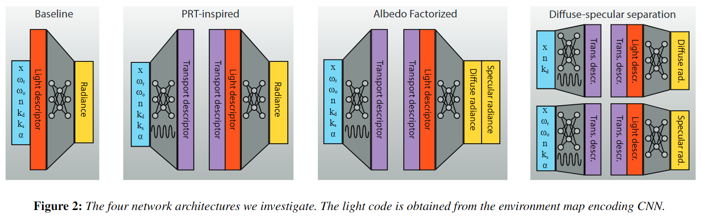

# 摘要
基于静态场景+动态全局光照的假设，提出和对比了四种神经网络结构来获取预计算全局光照。输入环境观贴图和G-Buffer，通过网络推理得到实时环境光照结果。

# 数学依据
PRT将光线传播过程使用算子建模为三个部分：
$$
L=RSE
$$
即：最后一次反射、传播矩阵和光源
其中，反射可根据BRDF分为漫反射和光滑反射，因此有：
$$
L=R_DSE+R_SSE
$$

# 算法

如上图，论文研究了四个网络结构
## 环境光编码
类似于传统PRT将环境光通过基函数编码为一个向量，使用一个CNN来对环境光进行编码：
$$
\hat{e}=\mathcal{F}_L(E)
$$
## Baseline
第一种结构直接使用神经网络求解Radiance，输入着色点信息(除了渲染方程参数之外，还输入了反射方向以方便神经网络进行理解)以及环境光编码：
$$
L=\hat{\mathcal{S}}(\hat{\mathbf{e}},\mathbf{x},\mathbf{\omega}_o,\mathbf{\omega}_r,\mathbf{n},k_d,k_s,\alpha)
$$
网络结构只使用多层感知机和ReLU函数
## PRT-Inspired
第二种结构参考PRT的流程，将传播过程（传播矩阵）单独采用一个神经网络表示，即：
$$
\hat{\mathbf{s}}=\mathcal{F}_T(\mathbf{x},\mathbf{\omega}_o,\mathbf{\omega}_r,\mathbf{n},k_d,k_s,\alpha)
$$
传播过程采用多层感知机训练。综合这个传播结果与环境光编码，得到最后的光照结果：
$$
L=\Phi(\hat{\mathbf{s}},\hat{\mathbf{e}})
$$

## Albedo Factorized
第三种结构和第二种一样，将传播过程单独分离出来，但求解光照的算子输出两个diffuse和specular两个光照结果，最后将他们线性组合得到最终的结果
$$
\begin{matrix}
(L_D,L_S)=\Phi(\hat{\mathbf{s}},\hat{\mathbf{e}})\\
L=k_dL_D+k_sL_S
\end{matrix}
$$
