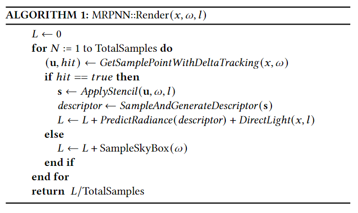
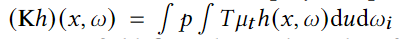
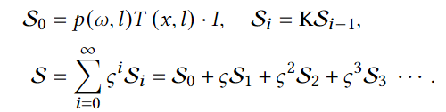
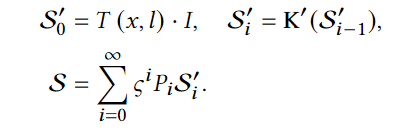

# 摘要
使用一种新的网络来预测体路径追踪中的In-Scattering项，从而使体路径追踪达到实时水平。论文提出了一种频率敏感的模板解决了非云物体使用神经网络预测的体路径追踪方法中，阴影绘制不正确的问题。

# 算法依据
## 原RPNN的弊端
+ 输入过于简单，网络无法理解光线传播的深层次规律，这导致了它无法正确处理阴影的情况
+ 一些参数被硬编码在网络中，每次修改都要重新训练网络
## 动机
从RTE出发，将介质的特征分解成为：密度场、预积分的相函数以及albedo，分别输入网络，网络会更容易理解这些特征与整个光线传播过程的联系。
为了解决阴影绘制不正确的问题，将采样的模板分为低频和高频两部分，分别使用网络进行处理。

# 算法框架

主要是将采样点处理为神经网络的输入，将间接光照项用神经网络输出代替。
## 数学依据
$$
\begin{matrix}
\text{从体渲染方程出发，做以下推导：}\\
L(\mathbf{x},\omega)=\int_\mathbf{x}^\mathbf{z}T(\mathbf{x},\mathbf{u})\mu_SS(\mathbf{u},\omega)d\mathbf{u}+T(\mathbf{x},\mathbf{z})L_S(\mathbf{z},\omega)\\
\text{如果只考虑方向光，则可以简化}L_S:\\
L_S=\delta(<l,\omega>+1)\cdot I\\
\text{内散射项：}\\
S(\mathbf{x},\omega)=\int_{\Omega}p(\omega,\omega_i)L(\mathbf{x},\omega_i)d\omega_i\\
\text{对整个式子积分：}\\
S(\mathbf{x},\omega)
=\int_\Omega p(\omega_i,\omega)L(\mathbf{x},\omega)d\omega_i
=\int_\Omega p(\omega_i,\omega)\int_\mathbf{x}^\mathbf{z}T(\mathbf{x},\mathbf{u})\mu_SSd\mathbf{u}d\omega_i+p(\omega,l)T(\mathbf{x},l)\cdot I\\
\text{由}\xi=\frac{\mu_s}{\mu_t}\text{：}\\
S(\mathbf{x},\omega)
=\xi\int_\Omega p(\omega_i,\omega)\int_\mathbf{x}^\mathbf{z}T(\mathbf{x},\mathbf{u})\mu_tSd\mathbf{u}d\omega_i+p(\omega,l)T(\mathbf{x},l)\cdot I\\
\end{matrix}
$$
算子化，有：

整个求解过程变为如下级数：

提取上述式子的特征，有：

论文认为，网络通过albedo、相位函数和方向无关项$S_i$这三个特征就可以推理出$S$
## 对方向无关项的近似
首先是对透射率$T(\mathbf{x},l)$的近似，