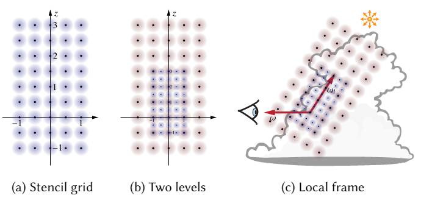

# 目标
在云雾渲染中，由于云雾没有自发光，因此体渲染的方程变为：
$$
\begin{matrix}
L(x,\omega)=\int_0^zT(x,x')\sigma_s(x')L_s(x',\omega)dt+T(x,x_s)L(x_s,\omega)\\
=\int_0^zT(x,x')\sigma_s(x')\int_{S^2}p(\mathbf{x},\omega_i,\omega)L_i(\mathbf{x},\omega)d\omega_idt+T(x,x_s)L(x_s,\omega)\\
\end{matrix}
$$
神经网络的目标即预测内散射$L_s$中的多重散射项，即：
$$
L_s(\mathbf{x},\omega)=\int_{S^2}p(\mathbf{x},\omega_i,\omega)(L_i(\mathbf{x},\omega)-L_d(\mathbf{x},\omega))d\omega_i
$$
# 方法
神经网络要用于拟合一个映射$g(\mathbf{z};\mathbf{\theta})$，这个映射将着色点描述符$\mathbf{z}$映射到对$L(\mathbf{x},\omega)$的估计。
用于网络训练的数据是一系列的描述符和对应的正确Radiance的集合，即：
$$
\mathcal{D}_N=\bigcup_i^n(z_i,L_i)
$$

## 着色点描述符
$\mathbf{z}$是一个针对于特定着色点$(\mathbf{x},\omega)$的体素模板和角度的集合$z=\{\Sigma,\gamma\}$
体素模板用于捕获着色点$\mathbf{x}$附近区域的体积信息，其分为$K$层，每一层的分辨率为$5\times5\times9$，每一层的边长为上一层的两倍
体素区域的原点位于着色点$x$，而$z$轴指向光源，第一层体素均匀分布于$[-1,-1,-1]$与$[1,1,3]$

问题：模板是参数还是一个零一两个状态的变量

## 网络结构
整个网络是一个MLP，每一大层包含两层线性映射，用ReLU作为激活函数，并且每一大层的输入通过一个旁路连接到最后的输出，每一大层负责接收一层的描述符

# 渲染
由于网络直接预测了内散射项中的间接光照部分，因此直接光照部分采用蒙特卡洛算法计算
# 训练
## 数据处理
数据处理的目的是从一个测试模型生成一对测试数据$(z_i,L_i(\mathbf{x},\omega))$
对于一朵给定的云，首先在它的包围球上随机取定一个点作为光线的发射点，通过追踪一个自由距离得到着色点$\mathbf{x}$
由于通常情况下云朵由天空盒照亮，而算法只能处理平行光，因此整个环境光（包含天空和地面的光照）由一些平行光模拟，得到着色点位置后，随机选择一个可以到达着色点的平行光的方向作为$\omega_l$，并计算ground truth得到$L_i$

## 损失函数

# 结果
+ 与路径追踪对比(性能评价指标：单位渲染时间造成的方差TTUV ):收敛速度平均快24倍
+ 与基于扩散理论的FLD对比：效果远好于FLD
