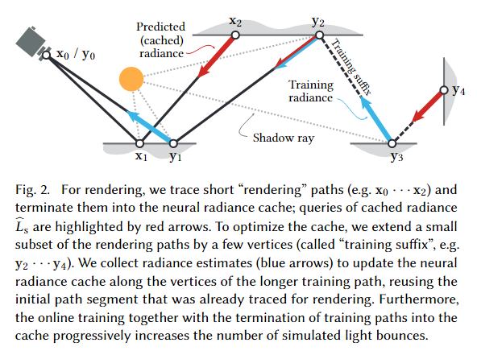

# 摘要

# 方法
## 流程

本文方法分为以下几步：
1. 每个像素追踪一条光线，并在认为它得到的光照结果足够精确(用一个启发式的方法决定停止时间)的时候停下，得到末顶点$x_k$，查询辐射度缓存估计在这点的辐射度$L_x(x_k, \omega_k)$
2. 对于一小部分像素，在停止之后多走几步，得到一条稍长的路径，用这条长路径上的顶点的预测的radiance来训练和更新辐射度缓存
## 自训练机制
本文用来更新缓存的radiance是由缓存本身预测出来的，这样做的好处有两个：
+ 减少了可能的输入网络的噪声
+ 潜在增加了网络对于多次弹射的信息的学习（多次弹射的信息由多个一次弹射的信息加起来）
但是有以下坏处：
+ 可能会采样到未学习过的点，导致下一次输入网络的信息不准确
+ 对于多次弹射的信息的学习往往难以考虑到长路径（因为每次只延伸一个弹射）
为了缓解以上问题，本文使用了一个比率来控制被轮盘赌终结的路径和真正无偏的路径的占比，每16个样本才有一个是被轮盘赌终结的(?)

## 时间稳定性
由于要处理动态场景，本文采用了一个较高的学习率，并且每帧会做多次优化来保证这个缓存学习到当前帧的场景的变化。这样可能会导致一定问题，缓存更新过快可能会导致闪烁或者是反复震荡。
为了解决这个问题，本文采用了两帧之间的指数平均移动策略来训练网络：
也就是网络权重的计算遵循：
$$
\overline{W_t}=\frac{1-\alpha}{1-\alpha^t}W_t+\alpha(1-\alpha^t)\overline{W_{t-1}}
$$
也就是说钳制当前帧获取的新信息对于网络的影响程度。

## 路径停止条件
本文借鉴了《A custom designed density estimation method for light transport》这篇文章给出的想法，用一个公式来衡量一段路径的散布范围（面积）：
$$
a(\mathcal{x}_1...\mathcal{x}_n)=(\sum_{i=2}^n\sqrt{\frac{||x_{i-1}-x_{i}||^2}{p_{BSDF}(\omega_i|x_{i-1,\omega})|(n\cdot\omega_i)|}})^2
$$
对于第一段光线，有一个范围估计：
$$
a_0=\frac{||x_{i-1}-x{i}||^2}{4\pi|(n\cdot\omega_i)|}
$$
当满足：$a(x_1....x_n)>c\cdot a_0$时停止路径，其中$c$为超参数。
事实上，这个面积表征了相机上一个像素（一条光线）所投射到场景上的面积。
