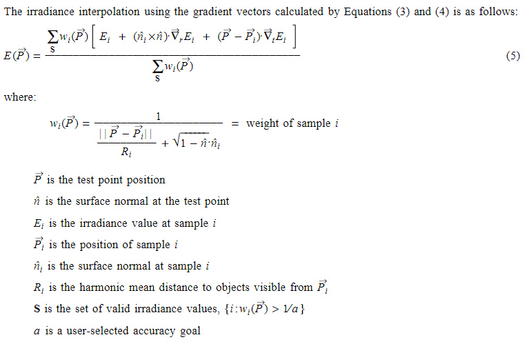

# 摘要
提出了一种将Irradiance梯度分为两个部分计算的方法，并将其用于Irradiance插值中，提高了插值的准确度

# 算法依据
影响一个表面Irradiance变化的因素一共有两个：
+ 当前表面与“发射”Irradiance的表面的法线角度差
+ 当前表面与“发射”Irradiance的表面之间是否有遮挡
从这两个因素考虑，可以分别计算出两个梯度Rotational Gradient和Translational Gradient

# Rotational Gradient
计算公式如下：

# Translational Gradient
计算公式如下：

# 插值
将以上两个梯度用于插值的公式如下：

